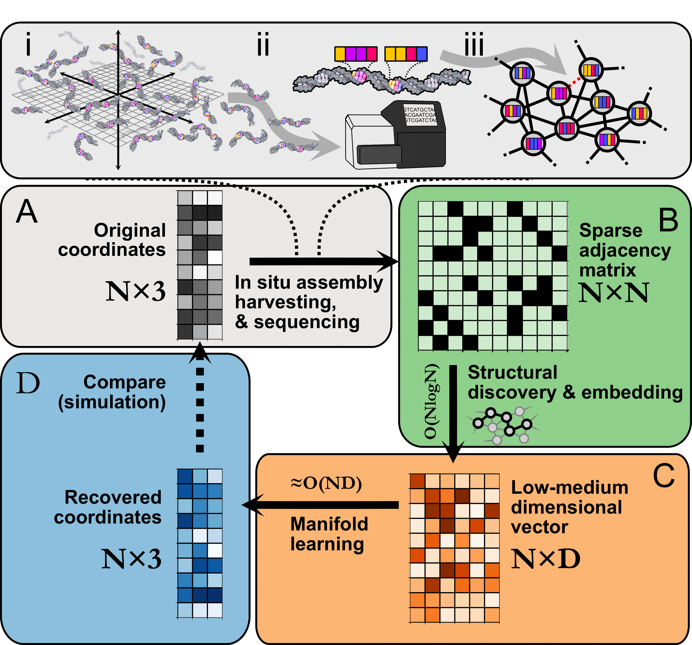
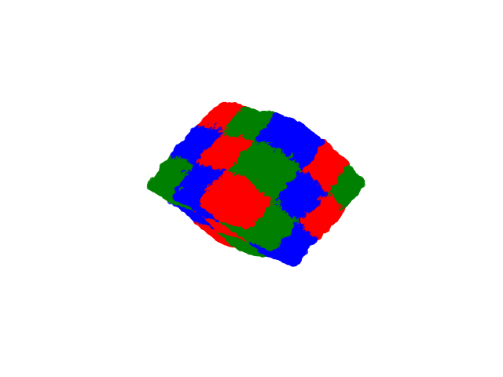

# Image Recovery

See [`demo.ipynb`](https://github.com/DavidFernandezBonet/ImageRecovery/blob/master/Code/Tutorials/demo.ipynb) for a step-by-step guide on the image recovery algorithm.

See [`hyperparameter_tuning.ipynb`](https://github.com/DavidFernandezBonet/Bayesian_Optimization_Image_Recovery/blob/master/Code/Tutorials/Hyperparameter%20Optimization%20in%20the%20context%20of%20Imaging-By-Sequencing.ipynb) for a tutorial on how to find the best set of hyperparameters. Bayesian Optimization is compared with Grid Search and Random Search.
